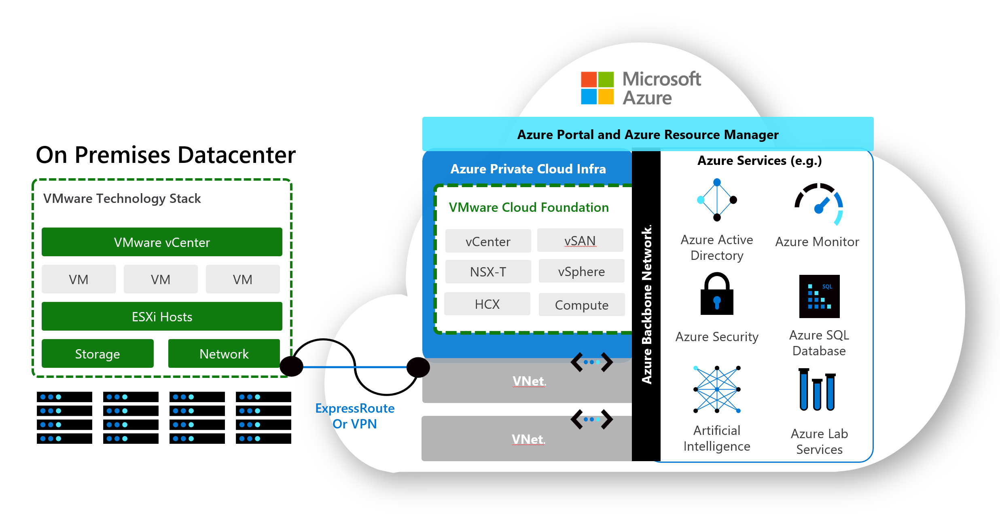
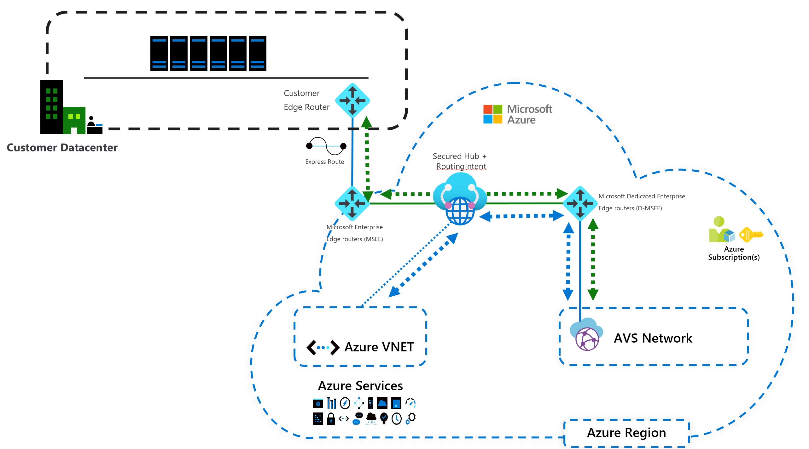
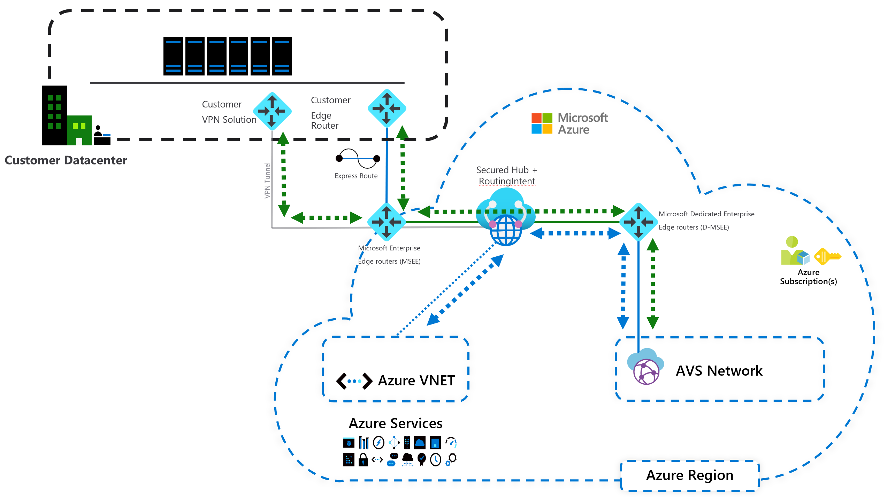
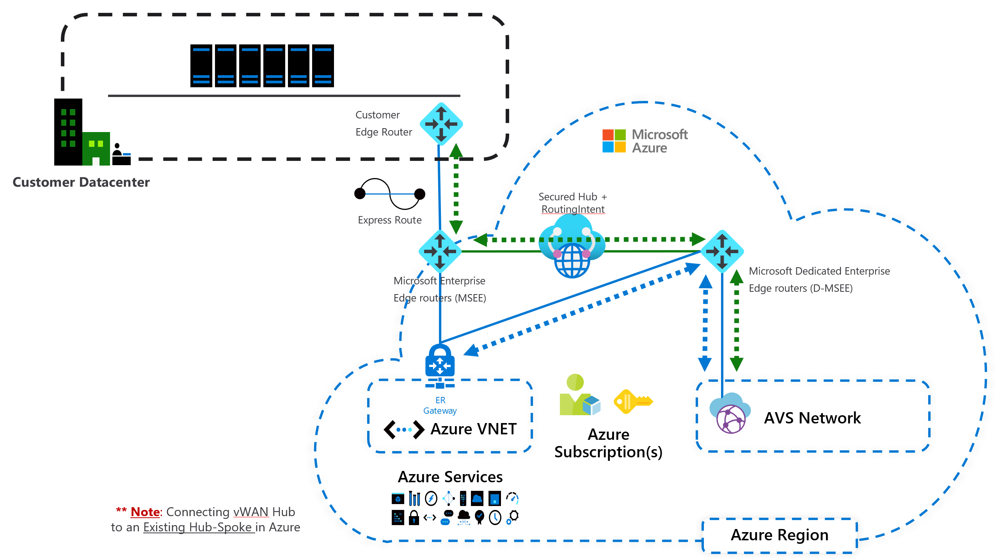
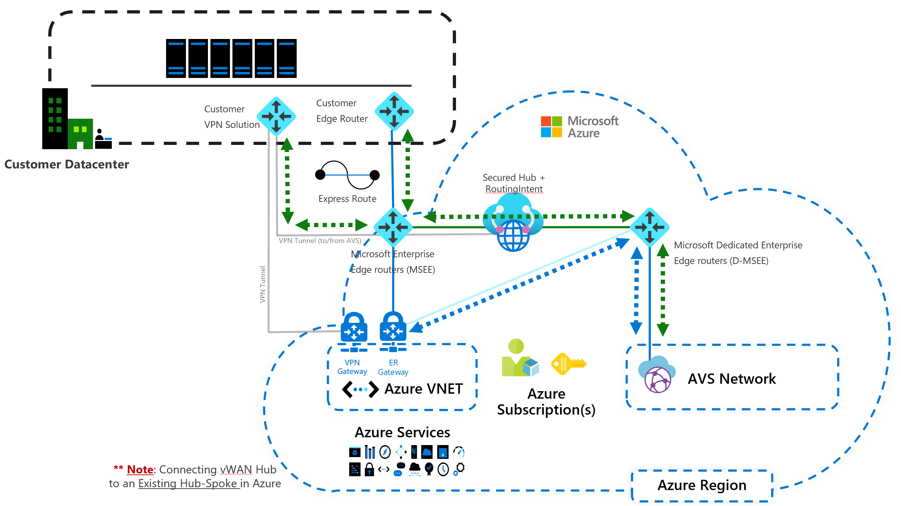

# AVS with vWAN Secure Hub + RoutingIntent (ER-to-ER connectivity)

## Navigation Menu: 
- [Overview/Summary](https://github.com/suellenferreira/AzureCore/edit/suellenferreira-patch-1/README.md#overviewsummary)
- [Docs for reference](https://github.com/suellenferreira/AzureCore/edit/suellenferreira-patch-1/README.md#docs-for-reference)
- [Common scenarios where "AVS with VWAN Secure Hub + RoutingIntent" is applicable](https://github.com/suellenferreira/AzureCore/edit/suellenferreira-patch-1/README.md#common-scenarios-where-avs-with-vwan-secure-hub--routingintent-is-applicable)

## Overview/Summary:

This document explains best practices to build an architecture to connect on-prem VMWare environment to Azure VMware Solutions (AVS) where ExpressRoute (ER) is used as circuit to connect on-prem to Azure and GlobalReach is unavailable or disabled for any reason. To provide this communication we will use Azure vWAN Secure Hub + Routing Intent to provide ER-to-ER connectivity (between on-prem and AVS).

We currently do not have a design document that explains how to provide ER-to-ER connectivity from on-prem to AVS with vWAN Secure Hub + RoutingIntent. This document gives our customers design best practices to use vWAN with Routing Intent in Dual Region AVS deployments.
  
### Docs for reference:
- [ExpressRoute GlobalReach availability (by country)](https://learn.microsoft.com/en-us/azure/expressroute/expressroute-global-reach#availability)
- [What is a secured virtual hub?](https://learn.microsoft.com/en-us/azure/firewall-manager/secured-virtual-hub)
- [About NVAs in a Virtual WAN hub](https://learn.microsoft.com/en-us/azure/virtual-wan/about-nva-hub)
- [Example architectures for Azure VMware Solutions - ESLZ Scenarios](https://learn.microsoft.com/en-us/azure/cloud-adoption-framework/scenarios/azure-vmware/example-architectures) (Note: The "AVS with VWAN Secure Hub + RoutingIntent" was not listed here when this article was built)

## Common scenarios where "AVS with vWAN Secure Hub + RoutingIntent" is applicable: 

- GlobalReach (GR) is not an option:
  1. GR not available in the country
  2. Inspection be between on-prem and AVS is a requirement to be done in Azure

- vWAN Secure Hub is already in use by Customer

### AVS General Architecture:
The following image is only for reference and illustrates how is a general architecture to connect on-prem workloads/vcenters to AVS.
In this article We will explore in more details how the connectivity can be build using "vWAN Secure Hub + RoutingIntent"

## AVS with vWAN Secure Hub + RoutingIntent Architecture (Greenfield):
### 1. (ER Only) AVS with vWAN Secure Hub + RoutingIntent Architecture (Greenfield):

### 2. (ER + VPN) AVS with vWAN Secure Hub + RoutingIntent Architecture (Greenfield):

## AVS with vWAN Secure Hub + RoutingIntent Architecture (Brownfield):
### 1. (ER Only) AVS with vWAN Secure Hub + RoutingIntent Architecture (Brownfield):

### 2. (ER + VPN) AVS with vWAN Secure Hub + RoutingIntent Architecture (Brownfield):

